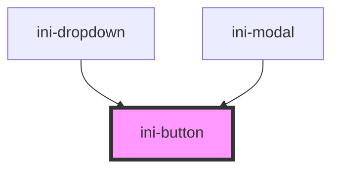

# ini-button

<!-- Auto Generated Below -->

## Properties

| Property     | Attribute     | Description | Type                                                                       | Default     |
| ------------ | ------------- | ----------- | -------------------------------------------------------------------------- | ----------- |
| `disabled`   | `disabled`    |             | `boolean`                                                                  | `false`     |
| `extraClass` | `extra-class` |             | `string`                                                                   | `""`        |
| `outline`    | `outline`     |             | `boolean`                                                                  | `false`     |
| `size`       | `size`        |             | `"large" \| "medium" \| "small"`                                           | `"medium"`  |
| `variant`    | `variant`     |             | `"danger" \| "info" \| "primary" \| "secondary" \| "success" \| "warning"` | `"primary"` |

## Events

| Event      | Description | Type               |
| ---------- | ----------- | ------------------ |
| `iniClick` |             | `CustomEvent<any>` |

## Dependencies

### Used by

 - [ini-dropdown](../ini-dropdown)
 - [ini-modal](../ini-modal)

### Graph

----------------------------------------------

*Built with [StencilJS](https://stenciljs.com/)*
