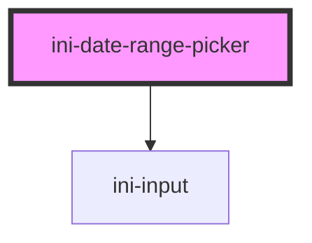

# ini-date-range-picker

<!-- Auto Generated Below -->

## Overview

Documentation of used Datepicker : https://mymth.github.io/vanillajs-datepicker

## Properties

| Property           | Attribute           | Description | Type      | Default        |
| ------------------ | ------------------- | ----------- | --------- | -------------- |
| `dateFormat`       | `date-format`       |             | `string`  | `"dd/mm/yyyy"` |
| `disabled`         | `disabled`          |             | `boolean` | `false`        |
| `endName`          | `end-name`          |             | `string`  | `""`           |
| `endPlaceholder`   | `end-placeholder`   |             | `string`  | `""`           |
| `endValue`         | `end-value`         |             | `string`  | `""`           |
| `helpText`         | `help-text`         |             | `string`  | `""`           |
| `label`            | `label`             |             | `string`  | `""`           |
| `startName`        | `start-name`        |             | `string`  | `""`           |
| `startPlaceholder` | `start-placeholder` |             | `string`  | `""`           |
| `startValue`       | `start-value`       |             | `string`  | `""`           |

## Dependencies

### Depends on

- [ini-input](../ini-input)

### Graph

----------------------------------------------

*Built with [StencilJS](https://stenciljs.com/)*
