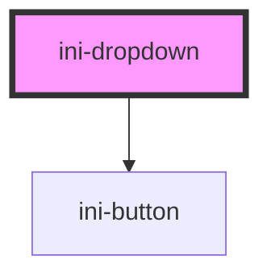

# ini-dropdown

<!-- Auto Generated Below -->

## Properties

| Property    | Attribute   | Description | Type                                     | Default    |
| ----------- | ----------- | ----------- | ---------------------------------------- | ---------- |
| `placement` | `placement` |             | `"bottom" \| "left" \| "right" \| "top"` | `"bottom"` |
| `size`      | `size`      |             | `"large" \| "medium" \| "small"`         | `"medium"` |

## Dependencies

### Depends on

- [ini-button](../ini-button)

### Graph

----------------------------------------------

*Built with [StencilJS](https://stenciljs.com/)*
