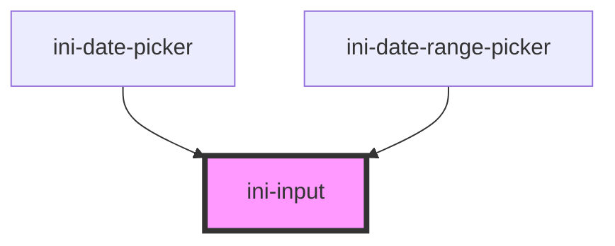

# ini-input

<!-- Auto Generated Below -->

## Properties

| Property      | Attribute     | Description                                 | Type                                                                                                           | Default    |
| ------------- | ------------- | ------------------------------------------- | -------------------------------------------------------------------------------------------------------------- | ---------- |
| `disabled`    | `disabled`    |                                             | `boolean`                                                                                                      | `false`    |
| `groupId`     | `group-id`    | The id value for input and label attributes | `string`                                                                                                       | `""`       |
| `helpText`    | `help-text`   |                                             | `string`                                                                                                       | `""`       |
| `inline`      | `inline`      |                                             | `boolean`                                                                                                      | `false`    |
| `label`       | `label`       |                                             | `string`                                                                                                       | `""`       |
| `name`        | `name`        |                                             | `string`                                                                                                       | `""`       |
| `placeholder` | `placeholder` |                                             | `string`                                                                                                       | `""`       |
| `prefixIcon`  | `prefix-icon` |                                             | `string`                                                                                                       | `""`       |
| `prefixText`  | `prefix-text` |                                             | `string`                                                                                                       | `""`       |
| `size`        | `size`        |                                             | `"large" \| "medium" \| "small"`                                                                               | `"medium"` |
| `suffixIcon`  | `suffix-icon` |                                             | `string`                                                                                                       | `""`       |
| `suffixText`  | `suffix-text` |                                             | `string`                                                                                                       | `""`       |
| `type`        | `type`        |                                             | `"color" \| "email" \| "file" \| "number" \| "password" \| "search" \| "tel" \| "text" \| "textarea" \| "url"` | `"text"`   |
| `value`       | `value`       |                                             | `string`                                                                                                       | `""`       |

## Methods

### `getInputRef() => Promise<HTMLElement>`

#### Returns

Type: `Promise<HTMLElement>`

## Dependencies

### Used by

 - [ini-date-picker](../ini-date-picker)
 - [ini-date-range-picker](../ini-date-range-picker)

### Graph

----------------------------------------------

*Built with [StencilJS](https://stenciljs.com/)*
